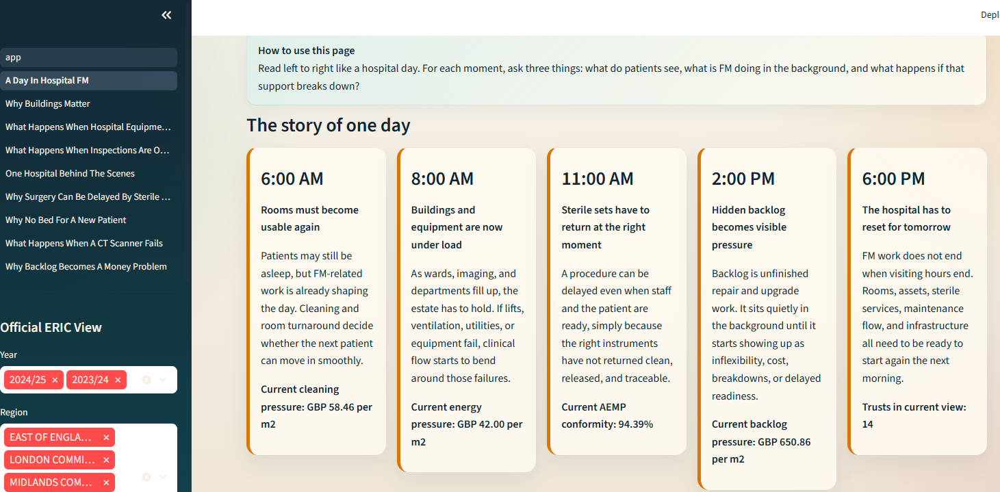
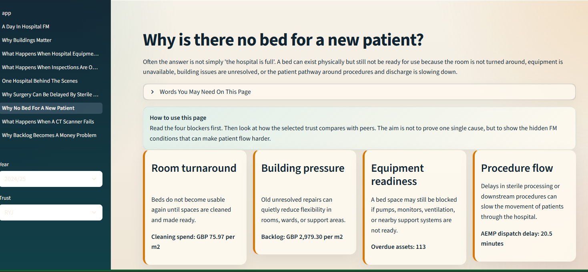
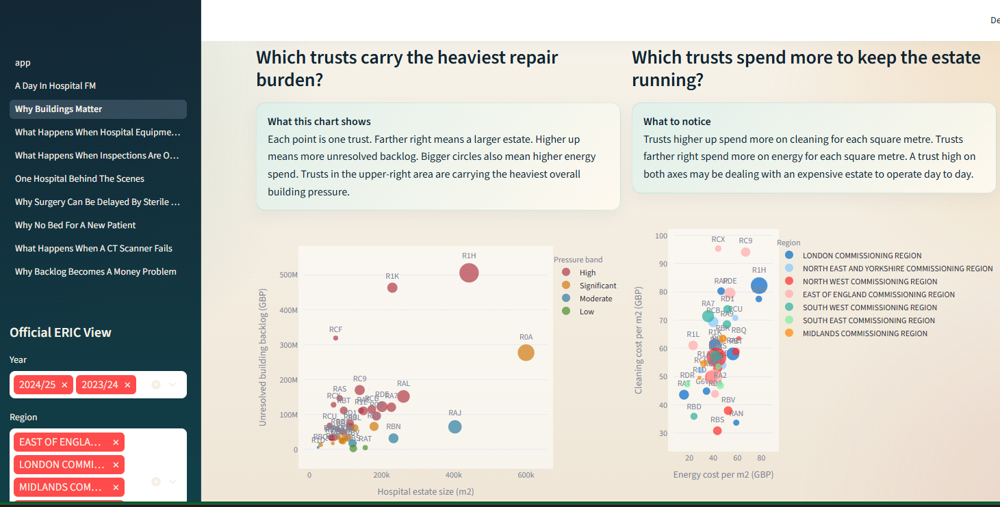

# Hospital FM Intelligence Hub

**Hospital FM Intelligence Hub** is a data engineering and storytelling portfolio project about hospital facility management.

The aim is not only to show pipelines and dashboards. The aim is to help someone understand how a hospital runs behind the scenes through buildings, maintenance, compliance, sterile services, and backlog pressure.

## Product Vision

This project combines:
- official NHS ERIC estate data
- synthetic but realistic hospital operations data
- a local DuckDB warehouse
- Bruin pipelines
- a multi-page Streamlit learning app

The current product direction is:
- explain hospital FM through scenarios, not only KPIs
- connect hidden FM work to patient flow and care readiness
- keep the language simple enough for non-experts
- use real estate data plus believable synthetic operational layers

Supporting docs:
- [docs/project-vision.md](docs/project-vision.md)
- [docs/implementation-plan.md](docs/implementation-plan.md)
- [docs/architecture.md](docs/architecture.md)
- [docs/kpi-catalog.md](docs/kpi-catalog.md)
- [docs/scenario-map.md](docs/scenario-map.md)
- [docs/source-log.md](docs/source-log.md)

## Screenshots

### A Day In Hospital FM



### Why Is There No Bed For A New Patient?



### Why Buildings Matter



## What Is Live Right Now

### Real Data Layer
- Official NHS ERIC site data for `2023/24` and `2024/25`
- Trust-level estate metrics built from the site returns
- Backlog, energy, cleaning, area, and trust-level risk views

### Synthetic Operations Layer
- Equipment register
- Maintenance events
- Compliance inspection status
- SAP-like work-order flow states
- Work-order response and aging signals
- AEMP cycle and batch data

### Streamlit Product Pages
- `app.py`: start page and navigation
- `1_A_Day_In_Hospital_FM.py`: guided story page
- `2_Why_Buildings_Matter.py`: estate pressure explainer
- `3_What_Happens_When_Hospital_Equipment_Fails.py`: equipment and maintenance story
- `4_What_Happens_When_Inspections_Are_Overdue.py`: compliance story
- `5_One_Hospital_Behind_The_Scenes.py`: trust-level integrated view
- `6_Why_Surgery_Can_Be_Delayed_By_Sterile_Instruments.py`: AEMP story
- `7_Why_No_Bed_For_A_New_Patient.py`: patient-flow scenario
- `8_What_Happens_When_A_CT_Scanner_Fails.py`: CT failure scenario
- `9_Why_Backlog_Becomes_A_Money_Problem.py`: finance scenario

## First-Time Walkthrough

If you are opening the app for the first time, use this order:

1. Start at `app.py` to choose a learning path.
2. Open `1_A_Day_In_Hospital_FM.py` for the guided story.
3. Open `7_Why_No_Bed_For_A_New_Patient.py` for the clearest patient-flow scenario.
4. Open `8_What_Happens_When_A_CT_Scanner_Fails.py` for a concrete equipment breakdown example.
5. Open `5_One_Hospital_Behind_The_Scenes.py` to bring the full trust picture together.

## Architecture

### Data Sources
- NHS ERIC trust and site files in `data/raw/nhs_eric/`
- Synthetic operational CSVs in `data/raw/synthetic/`

### Pipeline Stack
- `Python` for synthetic generators and utility scripts
- `Bruin` for ingestion, staging, and marts
- `DuckDB` for the local analytical warehouse
- `Streamlit` for the app layer

### Main Flow
1. Download and normalize source files
2. Generate synthetic hospital process data
3. Load all sources into DuckDB with Bruin
4. Build staging views and trust-level marts
5. Render the app from the mart layer

For a fuller system view, see [docs/architecture.md](docs/architecture.md).  
For KPI definitions, see [docs/kpi-catalog.md](docs/kpi-catalog.md).

## Repository Structure

```text
hospital-fm-intelligence/
|-- dashboard/
|   |-- app.py
|   |-- lib.py
|   `-- pages/
|-- data/
|   `-- raw/
|       |-- nhs_eric/
|       `-- synthetic/
|-- docs/
|   `-- images/
|-- generators/
|-- pipelines/
|   `-- assets/
|       |-- ingestion/
|       |-- staging/
|       `-- marts/
|-- scripts/
`-- hospital_fm.db
```

## Quick Start

### 1. Create a virtual environment

```powershell
python -m venv .venv
.\.venv\Scripts\activate
pip install -r requirements.txt
```

### 2. Prepare the real and synthetic data

Normalize the official ERIC site CSV encodings:

```powershell
python scripts/normalize_eric_csv_encoding.py
```

Generate synthetic maintenance and AEMP data:

```powershell
python generators/generate_equipment_data.py
python generators/generate_aemp_data.py
```

### 3. Build the DuckDB warehouse

```powershell
bruin run pipelines/
```

### 4. Launch the app

```powershell
streamlit run dashboard/app.py
```

## Current Marts

Examples of core marts already in use:
- `kpi_eric_real_trust_estate_metrics`
- `kpi_equipment_reliability`
- `kpi_equipment_compliance`
- `kpi_work_order_flow`
- `kpi_work_order_aging`
- `fact_equipment_work_orders`
- `kpi_aemp_process_summary`
- `kpi_aemp_shift_load`
- `kpi_trust_operational_cockpit`

## Current Scope

### Implemented
- Estate pressure from official NHS ERIC site data
- Equipment reliability and maintenance flow
- Compliance control
- Trust operational cockpit
- AEMP synthetic process layer
- Scenario-first product navigation
- Finance explanation through backlog and cost pressure
- Screenshot-backed project presentation

### Not Yet Implemented
- room-turnaround and bed-readiness event data
- broader HR and IT domain expansion
- procure-to-pay and broader SAP process simulation
- richer scenario-specific synthetic detail beyond the current layers

## Important Notes

- Bed-normalized official energy metrics are not yet the main live metric because the published site CSVs do not directly expose total available beds in the same shape as the site-level estate fields.
- The synthetic layers are intentionally synthetic. They are designed to be operationally believable and aligned to trust scale, not to represent live hospital records.

## Why This Repo Exists

This repo is meant to show both:
- technical data engineering ability
- real hospital FM domain understanding
- the ability to turn complex operations into a learning product

The standard is simple:

> Someone should come away understanding how a hospital runs behind the scenes, not just what the charts say.
