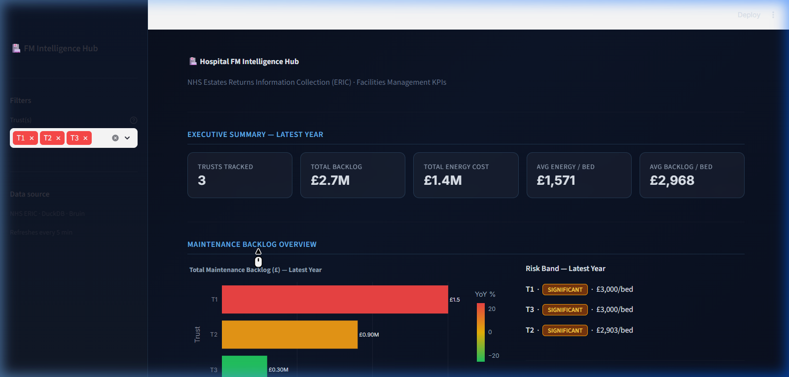
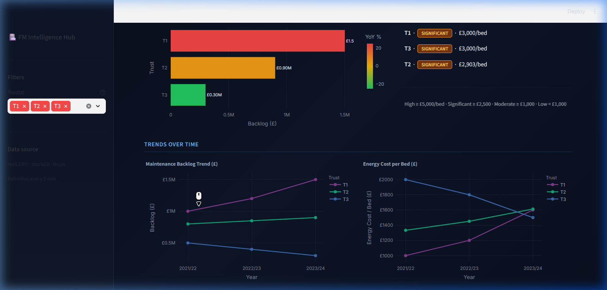

# 🏥 Hospital FM Intelligence Hub

An enterprise-grade analytics platform for **NHS Estates Returns Information Collection (ERIC)**, delivering automated Facilities Management (FM) insights, risk classification, and efficiency KPIs.



## 🚀 Overview
The **Hospital FM Intelligence Hub** transforms raw NHS ERIC data into actionable intelligence. It automates the calculation of critical FM metrics—like maintenance backlog density and energy efficiency—allowing healthcare leaders to identify estates at risk and optimize operational spend.

### ✨ Key Features
- **Automated Risk Banding:** Classifies trusts into HIGH, SIGNIFICANT, MODERATE, or LOW risk categories based on backlog-to-bed density.
- **YoY Trend Analytics:** Tracks maintenance backlog and energy cost growth across multiple years.
- **Efficiency KPIs:** Standardizes performance comparisons using "cost per bed" metrics.
- **Dark Analytics UI:** A high-performance, dark-themed dashboard built with Streamlit and Plotly.

---

## 🏗️ Architecture
The project uses a high-performance **DuckDB** backend orchestrated by **Bruin** for a seamless ELT (Extract, Load, Transform) experience.

- **Storage:** [DuckDB](https://duckdb.org/) (In-process OLAP database)
- **Orchestration:** [Bruin](https://getbruin.com/) (SQL transformation & data quality)
- **Visuals:** [Streamlit](https://streamlit.io/) + [Plotly](https://plotly.com/)

---

## 📈 Visualizations
### Maintenance & Efficiency Trends
Visualize how estates have evolved over time, identifying which trusts are seeing rapid growth in their maintenance backlog.



---

## ⚙️ Quick Start

### 1. Prerequisites
- **Python 3.10+**
- **Bruin CLI** ([Install Guide](https://getbruin.com/docs/bruin/getting-started/introduction/installation.html))

### 2. Environment Setup
Clone the repository and set up your Python environment:
```powershell
# Create and activate virtual environment
python -m venv .venv
.\.venv\Scripts\activate

# Install dependencies
pip install -r requirements.txt
pip install plotly streamlit
```

### 3. Run the Data Pipeline
Execute the Bruin pipeline to ingest the raw ERIC data and build the analytics marts in your local DuckDB:
```powershell
.\bruin.exe run pipelines/
```

### 4. Launch the Dashboard
Start the interactive Streamlit dashboard:
```powershell
streamlit run dashboard/app.py
```
*Access the UI at `http://localhost:8501`*

---

## 🛠️ Project Structure
- `pipelines/assets/`: SQL transformations organized by layer (**Staging** ➔ **Marts**).
- `data/raw/`: Source NHS ERIC data (CSV format).
- `dashboard/`: Streamlit application code and custom CSS.
- `hospital_fm.db`: Local DuckDB instance where all analytics are stored.

---
**Hospital FM Intelligence Hub** · Built by Antigravity
