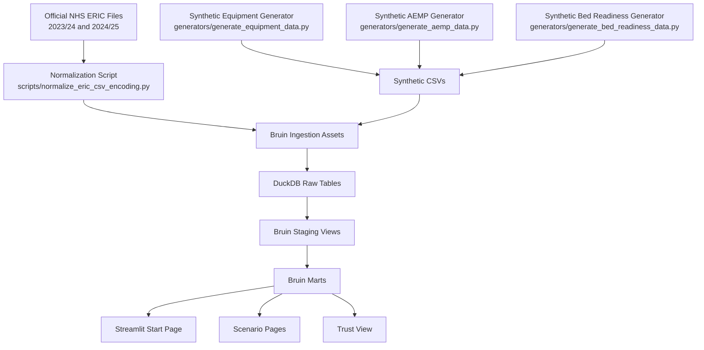

# Architecture

## Purpose

The project architecture is designed to support two things at the same time:

1. a reproducible local data engineering workflow
2. a storytelling product about hospital facility management

It combines real NHS estate data with synthetic operational data so the app can explain both high-level estate pressure and day-to-day hospital support processes.

## High-Level Flow

## Source Layers

### 1. Official ERIC Data

Location:
- [data/raw/nhs_eric](C:/Users/Melek/hospital-fm-intelligence/data/raw/nhs_eric)

Purpose:
- provide real trust and site-level estate context
- anchor the project in real NHS benchmark data

Current live use:
- maintenance backlog
- energy cost
- cleaning cost
- gross internal floor area
- trust-level estate pressure

### 2. Synthetic Equipment Data

Location:
- [generators/generate_equipment_data.py](C:/Users/Melek/hospital-fm-intelligence/generators/generate_equipment_data.py)
- [data/raw/synthetic](C:/Users/Melek/hospital-fm-intelligence/data/raw/synthetic)

Purpose:
- simulate asset register and maintenance operations
- create equipment lifecycle, reliability, compliance, and work-order flow

Current live use:
- equipment register
- maintenance events
- inspection status
- work-order states
- work-order response and aging

### 3. Synthetic AEMP Data

Location:
- [generators/generate_aemp_data.py](C:/Users/Melek/hospital-fm-intelligence/generators/generate_aemp_data.py)
- [data/raw/synthetic](C:/Users/Melek/hospital-fm-intelligence/data/raw/synthetic)

Purpose:
- simulate sterile processing cycles and dispatch flow
- create process KPIs for conformity, traceability, and reprocessing

Current live use:
- cycle runs
- batch records
- shift profile
- bottleneck stage summary

### 4. Synthetic Bed-Readiness Data

Location:
- [generators/generate_bed_readiness_data.py](C:/Users/Melek/hospital-fm-intelligence/generators/generate_bed_readiness_data.py)
- [data/raw/synthetic](C:/Users/Melek/hospital-fm-intelligence/data/raw/synthetic)

Purpose:
- simulate bed turnover and room-readiness timing
- create patient-flow signals that connect FM work to visible operational delay

Current live use:
- discharge-to-ready events
- turnaround timing
- blocker categories
- within-target and p90 readiness signals

## Warehouse Layers

### Ingestion

Location:
- [pipelines/assets/ingestion](C:/Users/Melek/hospital-fm-intelligence/pipelines/assets/ingestion)

Responsibility:
- load source CSV files into DuckDB raw tables

Examples:
- ERIC site loads
- equipment register load
- maintenance events load
- bed turnover events load
- AEMP cycle and batch loads

### Staging

Location:
- [pipelines/assets/staging](C:/Users/Melek/hospital-fm-intelligence/pipelines/assets/staging)

Responsibility:
- standardize types
- normalize source columns
- create reusable clean views for marts

Examples:
- ERIC site core staging
- equipment register staging
- maintenance event staging
- bed turnover event staging
- AEMP cycle and batch staging

### Marts

Location:
- [pipelines/assets/marts](C:/Users/Melek/hospital-fm-intelligence/pipelines/assets/marts)

Responsibility:
- produce trust-level and process-level KPIs used directly by the app

Core mart groups:

#### Estate
- `kpi_eric_real_trust_estate_metrics`
- `kpi_trust_summary`
- `kpi_backlog_risk_band`

#### Equipment and Maintenance
- `kpi_equipment_reliability`
- `kpi_work_order_flow`
- `fact_equipment_work_orders`

#### Compliance
- `kpi_equipment_compliance`
- `fact_equipment_compliance_assets`

#### AEMP
- `kpi_aemp_process_summary`
- `kpi_aemp_shift_load`

#### Bed Readiness
- `fact_bed_readiness_events`
- `kpi_bed_readiness_summary`

#### Integrated Trust View
- `kpi_trust_operational_cockpit`

## Application Layer

Location:
- [dashboard](C:/Users/Melek/hospital-fm-intelligence/dashboard)

### Shared Logic
- [lib.py](C:/Users/Melek/hospital-fm-intelligence/dashboard/lib.py)

Responsibility:
- shared styles
- DuckDB connection
- reusable query helpers
- common sidebar filtering

### Main Entry
- [Start_Here.py](C:/Users/Melek/hospital-fm-intelligence/dashboard/Start_Here.py)

Responsibility:
- scenario-first navigation
- product framing
- quick entry points into the learning app

### Scenario And Story Pages
- [1_A_Day_In_Hospital_FM.py](C:/Users/Melek/hospital-fm-intelligence/dashboard/pages/1_A_Day_In_Hospital_FM.py)
- [2_Why_Buildings_Matter.py](C:/Users/Melek/hospital-fm-intelligence/dashboard/pages/2_Why_Buildings_Matter.py)
- [3_What_Happens_When_Hospital_Equipment_Fails.py](C:/Users/Melek/hospital-fm-intelligence/dashboard/pages/3_What_Happens_When_Hospital_Equipment_Fails.py)
- [4_What_Happens_When_Inspections_Are_Overdue.py](C:/Users/Melek/hospital-fm-intelligence/dashboard/pages/4_What_Happens_When_Inspections_Are_Overdue.py)
- [5_One_Hospital_Behind_The_Scenes.py](C:/Users/Melek/hospital-fm-intelligence/dashboard/pages/5_One_Hospital_Behind_The_Scenes.py)
- [6_Why_Surgery_Can_Be_Delayed_By_Sterile_Instruments.py](C:/Users/Melek/hospital-fm-intelligence/dashboard/pages/6_Why_Surgery_Can_Be_Delayed_By_Sterile_Instruments.py)
- [7_Why_No_Bed_For_A_New_Patient.py](C:/Users/Melek/hospital-fm-intelligence/dashboard/pages/7_Why_No_Bed_For_A_New_Patient.py)
- [8_What_Happens_When_A_CT_Scanner_Fails.py](C:/Users/Melek/hospital-fm-intelligence/dashboard/pages/8_What_Happens_When_A_CT_Scanner_Fails.py)
- [9_Why_Backlog_Becomes_A_Money_Problem.py](C:/Users/Melek/hospital-fm-intelligence/dashboard/pages/9_Why_Backlog_Becomes_A_Money_Problem.py)

## Design Principles

- Keep the official ERIC layer real and traceable
- Use synthetic data only where public operational datasets do not exist
- Push business logic into marts instead of burying it in Streamlit pages
- Build each operational domain as a coherent slice
- Use the trust cockpit to unify the domains into one hospital story

## Current Limitations

- Bed-normalized official metrics are still limited by the shape of the published ERIC site data
- Some scenario pages still reuse trust-level aggregates and could benefit from richer event-level operational data
- The trust-wide page is still denser than the rest of the learning journey
